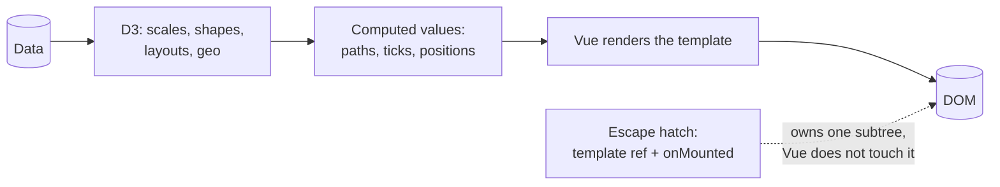

# {{number}}. D3 with Vue — Vue owns the DOM, D3 owns the math

## Context

D3 and Vue both want to own the DOM. If both mutate the same nodes, they fight: Vue's
patching reverts D3's changes, or D3 mutates nodes Vue believes it controls, causing subtle,
hard-to-debug corruption. Vue adds a second hazard React does not have — `ref`/`reactive`
wrap values in proxies, so a D3 object or a large dataset placed in reactive state is both
deeply tracked (a real cost on large arrays) and handed to D3 as a proxy rather than the
object it expects. Selecting both D3 and Vue forces a decision on who owns what.

## Decision

- **D3 owns the math; Vue owns the DOM.** Use D3's scales, shapes (`d3.line`, `d3.arc`),
  layouts, and geo generators to compute values, then render the resulting SVG in the
  template. Do not call `d3.select(...).append(...)` on Vue-managed nodes.
- **Keep D3 objects and large datasets out of deep reactivity** — hold them in
  `shallowRef`/`markRaw` so Vue tracks the reference, not every node of the structure, and
  D3 receives plain objects rather than proxies.
- Where an imperative D3 behavior is genuinely needed (complex transitions, zoom/brush),
  **isolate it behind a template `ref`** to an element Vue renders but does not patch after
  mount, and confine the D3 code to `onMounted` plus an explicit `watch`, with clear
  ownership of that subtree and teardown in `onUnmounted`.
- Derive scales and generators with `computed`, so they recompute only when data or
  dimensions change.

Where the line falls:

## Alternatives considered

- **Let D3 select and mutate Vue-managed nodes directly** (`d3.select(el).append(...)`
  outside the ref boundary) — rejected because Vue's patching and D3's imperative mutations
  both believe they own the same nodes, producing the exact corruption this ADR exists to
  avoid.
- **Render D3's output via `v-html`** — rejected because it discards Vue's event handling
  and patching for the chart subtree and reopens the XSS surface templates normally close.
- **Put the dataset and D3 objects in `ref`/`reactive` like any other state** — consistent
  on its face, but deep proxying a large dataset costs on every access, and D3 internals
  handed a proxy can compare or mutate the wrong identity.
- **Adopt a higher-level Vue charting library instead of raw D3** — rejected because it
  trades away direct access to D3's scales/shapes/layouts for a narrower, opinionated API,
  when the goal here is D3's full computational toolkit.

## Consequences

- No tug-of-war over the DOM: Vue patching and D3 no longer corrupt each other.
- Most charts become declarative templates driven by D3-computed values, which is testable
  and familiar to Vue developers.
- Large datasets stay cheap, because they are not deeply proxied.
- The escape hatch (template ref + lifecycle hooks) is imperative code inside a declarative
  tree, so it needs closer review, explicit teardown, and cannot be tested the way template
  components are.
